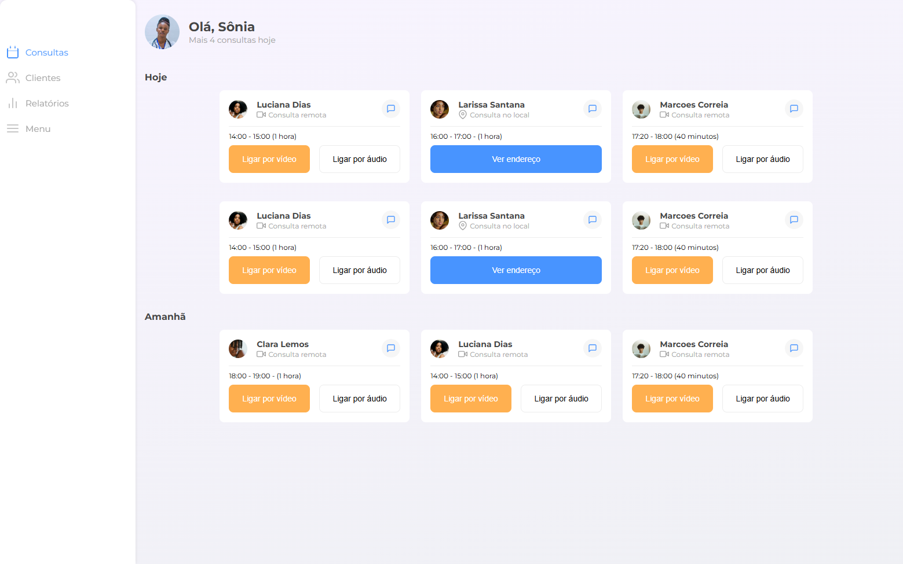
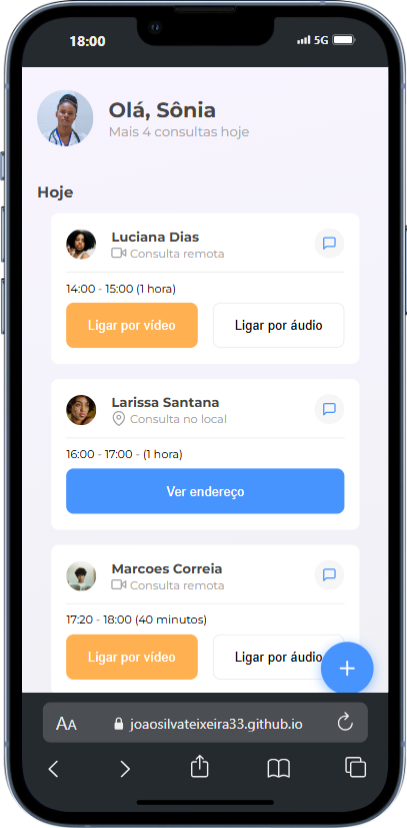

<h1 align="center" style="font-weight: bold;">Clinica-APP 💻</h1>

<p align="center">
 <a href="#tech">Technologies</a> • 
 <a href="#started">Getting Started</a> • 
  <a href="#colab">Collaborators</a> •
 <a href="#contribute">Contribute</a>
</p>

<p align="center">
    <b>
      Projeto em si visa uma aplicação web para clinica com opções de cadastrar consultar e remover uma consulta além de ver os clientes cadastrados 
    </b>
</p>

<p align="center" id="linkproject">
     <a href="https://joaosilvateixeira33.github.io/Clinica_web/">📱 Clinica Project </a>
</p>

<h2 id="layout">🎨 Layout</h2>

<p align="center">
    
    
</p>

<h2 id="technologies">💻 Technologies</h2>

- Html5
- Css3
- Javascript

<h2 id="started">🚀 Getting started</h2>

Acesso link <a href="#linkproject">em seu navegador</a>

<h3>Prerequisites</h3>

Here you list all prerequisites necessary for running your project. For example:

- [Chrome](https://chrome.com/)

<h3>Cloning</h3>

How to clone your project

```bash
git clone https://github.com/joaosilvateixeira33/Clinica_web
```

<h2 id="colab">🤝 Collaborators</h2>

<table>
  <tr>
      <td align="center">
          <a href="#">
              <br>
              <sub>
                <b>João Marcos Silva</b>
              </sub>
          </a>
      </td>
  </tr>
</table>
